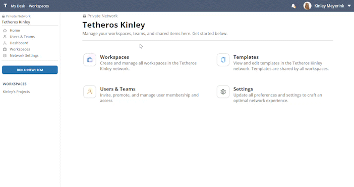
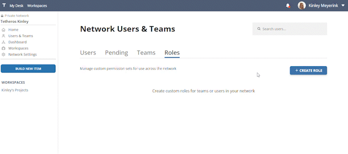
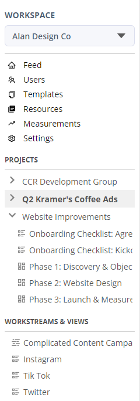

# Latest (v0.2.6)  
  
---

**Released:** March 13, 2023  
**Focus:** Membership Management
---  

Introducing a new toolset for managing network members, permissions, and teams.       
  
This release includes:  
- **[Network Members Panel:](#network-members-panel)** Control and permit users in your network with a greater set of tools and visibility  
- **[Custom Roles:](#custom-roles)** Cards on a board can be assigned a color for more personality (and inner beauty)
- **[Sidebar improvements:](#sidebar-improvements)** Removed network-level projects and goals (for now)
  
If you'd like to know what's coming down the pipeline, check out **[the roadmap](/docs/roadmap)**.  
  
## Network Members Panel  
  
*Pro licenses only*   

Control and permit users in your network with a greater set of tools and visibility.  

  
  
The network members panel allows you to:  
- Add multiple new users to the network at a time 
- View pending email invitations  
- Create, update, and delete Teams and their access  
- Build custom roles for users and teams to use across different network workspaces  
  
 
   
## Custom Roles  

*Pro licenses only*  

Create custom permission sets that can be assigned to an individual user or a team in a network.    
  
  

   
## Sidebar improvements  

The workspace sidebar now self-organizes according to projects, workstreams and views to reduce clutter and provide better context.  

  
  
Expand projects to see all related workstreams, or create a new workstream independent of a project.  

## Bugs   
- Fixed error that prevented the "wrong password" snackbar from appearing during a failed login attempt 
  
Find any others?  **[Let us know](mailto:ideas@tetheros.com)**

---  
Thoughts?  Comments?  Haiku?  **[Send it our way](mailto:ideas@tetheros.com)**