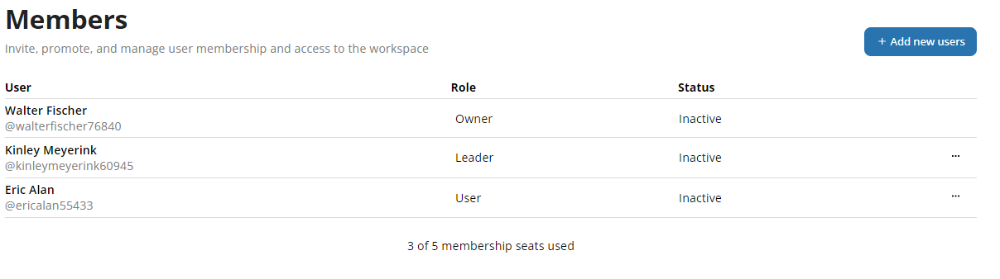

# Latest (version 0.2.0)  
  
---

**Released:** October 24, 2022  
**Focus:** Licensing updates and assignment clarity
---  
As our licensing model matures and becomes more clear, we're making updates on the front and back end of Tetheros to provide a crystal clear experience for your tier.  Anyone who has been part of Tetheros to this point was given an `Alpha` license which allows for 5 private workspaces with a 40-user limit.  
  
*Changes made this release completely disrupted the permissions and authorization ecosystem, so we thought a minor version update was appropriate.*  
  
Enter: **v0.2.0**
  
This release includes:  
- **[License-driven permissions](#license-updates):** All user entitlements are determined by license tier  
- **[My Desk assignment improvements](#my-desk-assignment-improvements):** An unpolished version of your workspace-specific assignments  
- **[Initiative assignment clarity](#initiative-assignments):** Manage initiative-aligned items from one place    
- **[Private workspace user activity](#private-workspace-user-activity):** How active are your teammates?  
- **[Workspace dashboard improvements](#workspace-dashboard-improvements):** Manage all workspace items from the dashboard 
- **[Home feed adjustments](#):** Uncluttering and shifting workspace activity for easier consumption 

  
If you'd like to know what's coming down the pipeline, check out **[the roadmap](/docs/roadmap)**.  
# Product Experience  
  
### License Updates  

All users now have a license to track their entitlements, which currently include:  
- **Private Workspace Limit** - Maximum private workspaces a user can create  
- **Private Workspace User Limit** - Total number of people the user is allowed to have in each private workspace they own  
- **Network** - Whether or not they have access to a network  
  
Go to [Your Settings](https://tetheros.com/settings) to view your current license:  
  
  
As of this version, these are all available licenses:   
  
| **Tier** | **Private Workspace Limit** | **Private Workspace User Limit** | **Network** |
| --- | --- | --- | --- | 
| Basic | 1 | 5 | ❌ |   
| Pro | 1 | 5 | ✅ |   
| Founder | 10 | 40 | ✅ |   
| Alpha | 5 | 40 | ❌ |   
  
If an `Alpha` upgrades to a `Pro` license, they forfeit the right to additional workspaces if they haven't used them.  Existing workspaces are not taken away, nor are the users above the allowed limit.  
  
If a workspace already has users above the limit, no additional users may be added, but existing users will not be removed.  Any users removed while the workspace is hosting more than its limit will not be able to come back until the workspace has user capacity again.  
  
  

### Home feed adjustments  
  
The home feed now shows create, delete, and complete component operations in the right sidebar:  
  
  
  
This improvement relaxes the activity on the main feed to only display posts from teammates in the workspace.
 
# Team Management  
  
### Private workspace user activity  
The last activity of a user in a private workspace is shown on the `Members` tab:  

  
  
Enables you to know when your teammates are active - part of a larger ongoing effort to build user visibility into the application.  
  
Users that have no logged any activity are noted as `Inactive` (shown above).  

# Clarity  
  
### Initiative assignments  
Anything aligned with an initiative can be viewed in tabular form in the `Assignments` tab of the initiative:  
  
  
  
Manage the due dates and owners of any item in the assignments tab.  
  
### Workspace dashboard improvements  
  
Manage the ownership and due dates of all items in a workspace from the `Dashboard` panel:  
  
  

  
### My Desk assignment improvements  
My Desk now shows all your uncompleted assignments across all workspaces you are a member of.  
  
  
  
Later, you will be able to manage all assignments from here.  For now you can only review and navigate from this panel.
  
---  
Thoughts?  Comments?  Haiku?  **[Send it our way](mailto:ideas@tetheros.com)**