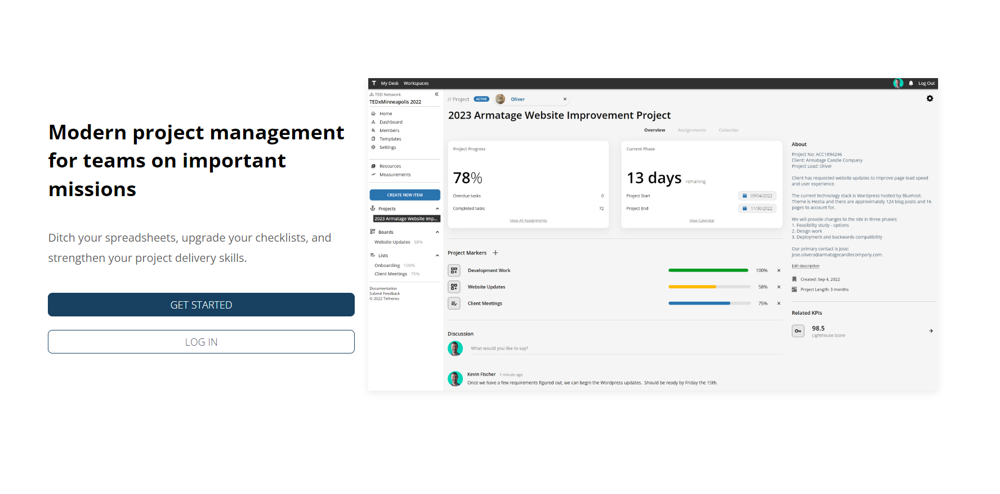

# Latest (v0.2.1)  
  
---

**Released:** November 23, 2022  
**Focus:** Project engagement and user experience  
---  

The term `initiative` is confusing, especially since the main user base has client-focused project teams, not enterprise business department groups.  We decided to re-introduce initiatives as **projects**.  
  
This release features revisions to projects (formerly, initiatives) along with a much-needed application facelift!
  
It also includes:  
- **[New User Interface](#user-interface):** A better header, sidebar, and color scheme to improve look and feel
- **[Projects](#projects):** Initiatives are now called projects, and they're way better 
- **[Home Page Improvements](#home-page-improvements):** Initiatives are now called projects, and they're way better 
- **[Breadcrumb Navigation](#breadcrumb-navigation):** Quickly align and see where items fit in the workspace ecosystem 
- **[Better Component Information](#better-component-information):** Improved layout for the About section of components 
- **[Easier Description Editing](#easier-description-editing):** Change your description with the click of a mouse 
- **[Project Dashboard Improvements](#project-dashboard-improvements):** A far more action-based dashboard than before 
- **[Squashed Bugs: 3](#squashed-bugs-3):** Resizing, routing, and overwriting... be gone! 

  
If you'd like to know what's coming down the pipeline, check out **[the roadmap](/docs/roadmap)**.  
## User Interface  
A few areas of the UI were updated to be more practical and pleasant:  
  
**Header**  
  
  
  
Updates:  
- New paint job  
- Menu for profile, settings, feedback, and logging out  
- Your first and last name, just in case you don't remember (yay, *personalization*)  
  
**Sidebar**  
  
  
  
Updates:  
- New colors
- Consolidated sections  
- Removed icons to modernize feel
 

## Projects  
Initiatives are now called Projects (they always *were* projects, but the name didn't really fit our users)  
  
  
  
Most information is moved into the right side and the main top area features the project description.  Useful for briefing your team on an effort at a glance.  
  
For now, the progress will show your timeline and task completion.  Task completion is only one aspect of the project (projects are also a function of goals).  Future improvements will highlight project goals and measurements.
  
## Home Page Improvements
The [**home page was updated**](https://tetheros.com/welcome) with an improved look and feel.  It also has a lot more information about Tetheros now!
  
  
  
(ironically, it doesn't have updated assets for the application UI at release... oops!)

## Breadcrumb Navigation
Lists, boards, goals, and projects feature breadcrumbs at the top that indicate where the component fits into the big picture.  
  
Items lacking an alignment can quickly be connected with any active projects by clicking `Set Project Alignment`:  
  
  

## Better Component Information  
Lists, goals, and projects now feature specific items in their about page.  Shown below: projects.  

  
  

## Easier Description Editing  
Descriptions can be edited on the fly - no more losing work because you didn't click "save" after you finished adding the project brief.  

   

## Project Dashboard Improvements  
Project dashboards no longer show lists and boards - they are being treated as separate from overall "assignments".  

Later releases will build on this idea - trust us!  

## Squashed Bugs: 3  
We got three (and found a few others, but they crawled away)!  
- Description text resizes based on scrollheight instead of line breaks  
- Fix component fetching overwriting display names being actively edited
- Fix routing problem when user session expires but localStorage indicates they are still authenticated  
  
Find any others?  **[Let us know](mailto:ideas@tetheros.com)**

---  
Thoughts?  Comments?  Haiku?  **[Send it our way](mailto:ideas@tetheros.com)**