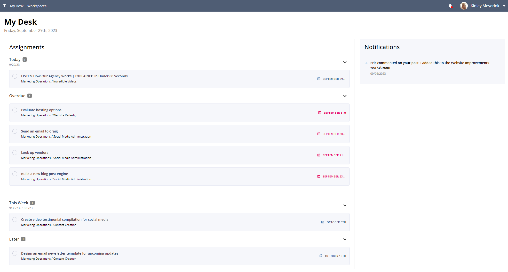

# Latest: v0.3.0
  
---

**Released:** September 22, 2023  
**Focus:** Communications Update #2
---  

A proper *smörgåsbord* of updates for improving clarity, personality, and visual improvements.  But mostly the clarity.   
  
This release includes:  
- **[My Desk:](#my-desk)** See more of what you care about in a new, more interactive My Desk view   
- **[Workspace Dashboard:](#workspace-dashboard)** The workspace dashboard has been restored, in case you want to micromanage your team
- **[Workspace Banners:](#workspace-banners)** Let your freak flag fly
  
If you'd like to know what's coming down the pipeline, check out **[the roadmap](/docs/roadmap)**.  
  
## My Desk  

My Desk now displays information in a list format:  
  

  
  
The new display is interactive, allowing you to check things off your list without leaving the comfort of your desk.  
  
It also includes all your unread notifications, expanding your ability to focus on what's in front of you without needlessly navigating the rest of Tetheros.

## Workspace Dashboard  

The workspace dashboard features a high level glance at everything you got going on:  
  
  
  
Currently featuring:  
- **Assignments:** All tasks, projects, and goals  
- **Work Distribution:** Where all current assignments stand and who they're assigned to  
- **Calendar:** Tasks with due dates are plotted out for review and management  
  
To view the dashboard, simply click `Dashboard` on the left-side panel in a workspace.  

## Workspace Banners  

Display a banner at the top of your workspace!    
   
  
  
Customize the banner from the workspace settings.  You must have the appropriate privilege to make this change.  
  
Recommended size: 2400px x 280px  

  
## Minor Updates  
  
Too small to get an entire section, too large to ignore:  
- Workspace feeds can now be filtered by user posts or updates  
- Updated landing page design  
- Added a calendar to the Network page  
- Calendar cells are bottomless now  
- Visual improvements to the project page  
- KPIs display their open goals 
  
## Bugs   
  
The latest release also dealt with these issues:  

- Workspace sidebar no longer bugs out because of stickiness
  
How'd we do?  Find any others?  **[Let us know](/bugs/report)**  

---  
Product ideas?  Comments?  Haiku?  **[Send it our way](/features/request)**  