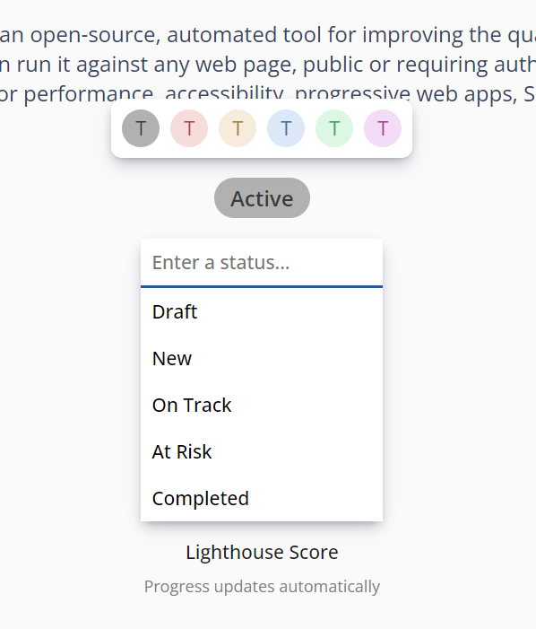

# Latest (v0.2.2)  
  
---

**Released:** December 23, 2022  
**Focus:** Projects and onboarding  
---  

Projects are more than just tasks - they're also goals, milestones, and deadlines.  We're constantly improving how `Projects` are used in Tetheros, starting with how you look at `Goals`.  

This release features significant improvements to the use of goals, KPIs, and project usability.  
  
The rundown:  
- **[Updated Goals](#updated-goals):** Significant improvements to how goals are created, viewed, and updated
- **[Adding goals to your project](#adding-goals-to-your-project):** Easier connecting and creating of project goals
- **[Navigating between workspaces](#navigating-between-workspaces):** A slick new dropdown
- **[Better user onboarding](#better-user-onboarding):** Start making progress faster
- **[Task page UI](#task-page-ui):** Moving things around and bringing them up to the current visual standard
- **[Deadlines and Activity sidebar improvements](#deadlines-and-activity-sidebar-improvements):** Better styles and feedback
- **[Larger profile pictures](#larger-profile-pictures):** No more squinting at your teammates faces
- **[Project page tasks bar](#project-page-tasks-bar):** Match the dates for a lighter cognitive load
- **[New home page visuals](#new-home-page-visuals):** Using the amazing power of Undraw to bring emotion to the landing page
- **[List and Board form improvements](#list-and-board-form-improvements):** Less confusing creation wizard
- **[Removed Trello importing support](#removed-trello-imports):** Noooooo!!!  (for now)
- **[Removed task auto-assignments](#removed-task-auto-assignment):** Creating less busywork when you're planning out tasks

  
If you'd like to know what's coming down the pipeline, check out **[the roadmap](/docs/roadmap)**.  

## Updated Goals  
Goals are now created as a 1:1 relationship with a KPI or a manual measurement:  
- **KPI-based:** The goal tracks the progress of a KPI in your workspace *automatically*  
- **Manually:** The goal can be updated by hand to reflect your progress  

  
  
You can also assign a status and a color to the goal that will be reflected in most other places the goal is referenced.  
  
  
  
## Adding goals to your project  
It's possible to connect goals to your project to reflect progress your team makes on non-task items.  

  
  
Future updates will build on this concept to display overall progress as a collective of task work, goals, and other project context.
  
## Navigating between workspaces  
Instead of trudging to the Workspaces screen and clicking multiple times to get around, use the new dropdown navigation on the left sidebar!  

  
 
## Better user onboarding 
New users (and anyone who hasn't already completed onboarding) are guided through a one-time setup to get started.  

  
  
If no parts of the onboarding process are skipped, the following items are created:  
- New private workspace  
- Project, built with the template selected by the user  
- Workstream, representative of any tasks the user identified
  
## Task page UI  
The task page was updated to include the latest visual standards, including:  
- Breadcrumb navigation in the header  
- Click-to-edit description  
- Task ownership and due date widgets  
  
## Deadlines and Activity sidebar improvements  
The sidebar on the home feed now displays items that are overdue and any major updates to workspace components (completion, deletion, reactivations, and archiving).  
  
## Larger profile pictures  
User profile picture allowance has been increased from 50kb to 2MB.  That's a lot of face-space!  
  
## Project page tasks bar  
The tasks indicator on the project page (appears below the timeline if there are any workstreams with tasks), now looks exactly like the timeline bar.  

We like when things match.  
  
## New home page visuals  
The home page now features people sketches thanks to [Undraw](https://undraw.co/)  
  
## List and Board form improvements  
Lists and board creation through the catalog has been improved to:  
- Allow only one project connection  
- Look a lot prettier than before  
  
## Removed Trello imports  
Support for Trello board imports has been removed for now.  Sad.  
  
## Removed task auto assignment  
We're no longer automatically assigning the tasks you create to YOU.  Even though you are special, this tended to create a lot of busywork of "removing yourself as owner" when you were just brainstorming work that had to get done.  

This will come back in the future as a setting (`Automatically assign to me`, or something to that effect)  
  
## Squashed Bugs: 4  
We got three (and found a few others, but they crawled away)!  
- Favicon wasn't loading  
- Lag and visual page quirks when quickly changing components in a workspace  
- Restore KPI updates that weren't loading  
- Login redirect wasn't working properly  
  
Find any others?  **[Let us know](mailto:ideas@tetheros.com)**

---  
Thoughts?  Comments?  Haiku?  **[Send it our way](mailto:ideas@tetheros.com)**