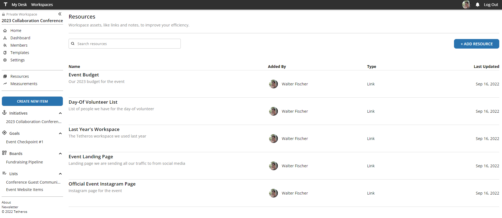
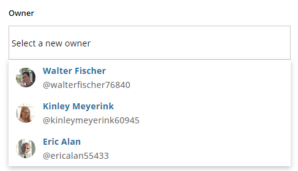

# v0.1.20  

## Where is the latest budget spreadsheet again???
Version v0.1.20 introduces `resources` to make it easy to track the location of shared digital assets.  Version 1 of the feature allows users to abstract web links with descriptions and keywords for discoverability.  
  
  
  
## Can you send a link to the landing page?  
Hyperlinks in text found throughout the application are clickable, including in:  
- Comments  
- Posts  
- Descriptions  
  
## "Assign that to me, please."  
The tooling for changing owners has been updated for a more modern experience:  
  
  

## Highlights
  
**Major Changes**  
- Add first version of `resources`: links to digital locations  
- Rebuild hyperlinking in posts, descriptions, and comments  
- Modify the assignment behavior tooling for a better, more modern, experience
  
**Minor Changes**  
- Remove workspace filter from My Desk  
- Show loading symbol for My Desk  
- Add a search feature for linking goals or subgoals  
  
**Fixed Bugs**  
- New users no longer errantly redirected to /welcome after new registration  
- Context shown in sidebar now refreshes more accurately when quickly changing focused component  
- Calendar "show more" modal no longer appears off screen