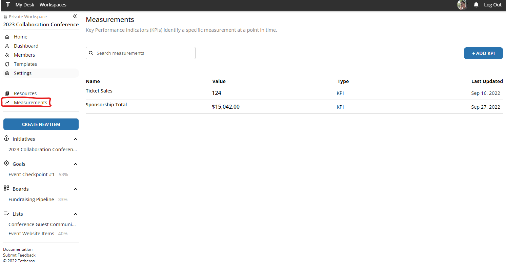
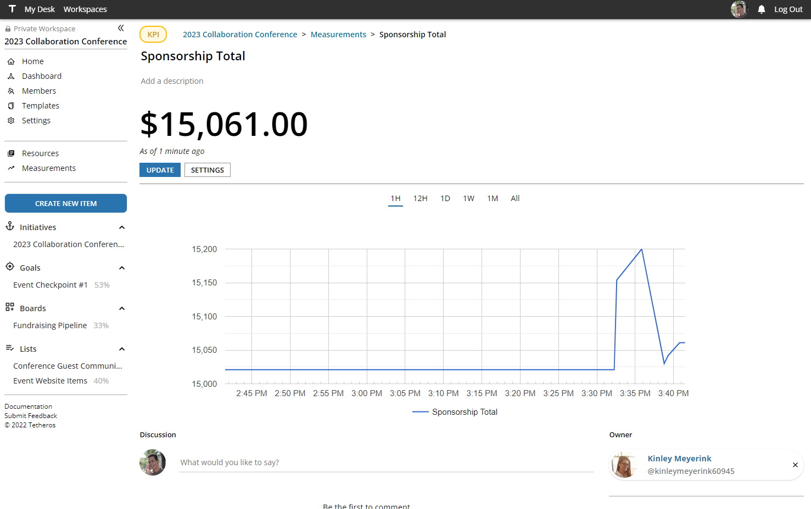

# v0.1.21  
**Released September 27, 2022**

## How Much Have We Fundraised So Far?  

Introducing a more thought-out KPI dashboard:  
  
  
  
Click on a KPI to go to it's hub:  
  
  
  
And view changes to the value over time using the filter above.  
  
## I Forgot My Password... Again  
  
Instead of logging out and clicking `Forgot Password` it's now possible to reset your password directly in the app!  
  
Just go to [Settings](https://tetheros.com/settings) and follow the prompts to update your password.  

## Version Highlights
  
**Major Changes**  
- Significant improvement to KPI interactions  
- Allow users to reset their passwords while authenticated
  
**Minor Changes**  
- Show percentage complete of workspace components in the sidebar  
- Update sidebar links to guide users to feedback portal and documentation site  
- Allow initiatives to track raw work, like boards and lists  
- Allow users to delete posts made to the workspace feed  
- Capture additional metadata (`creator_id` and `completor_id`) to WorkspaceComponents for future analytics  
  
**Fixed Bugs**  
Unfortunately, all existing bugs survived this release.
