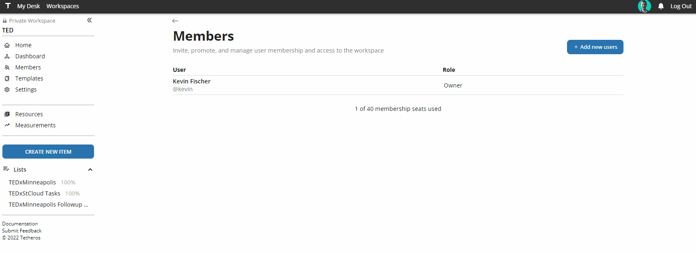
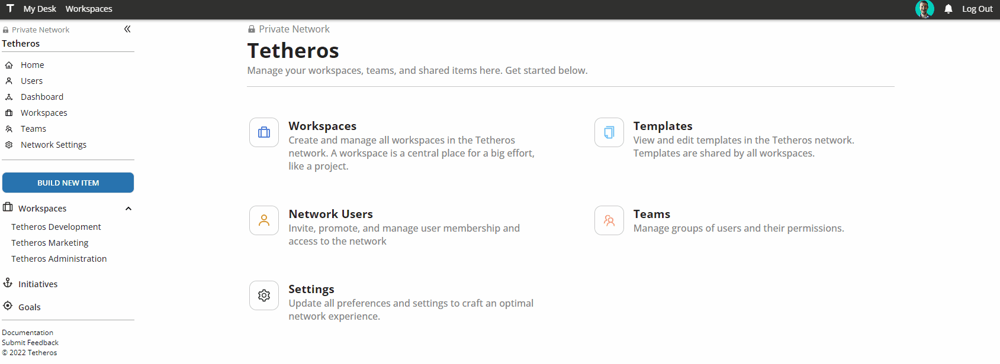
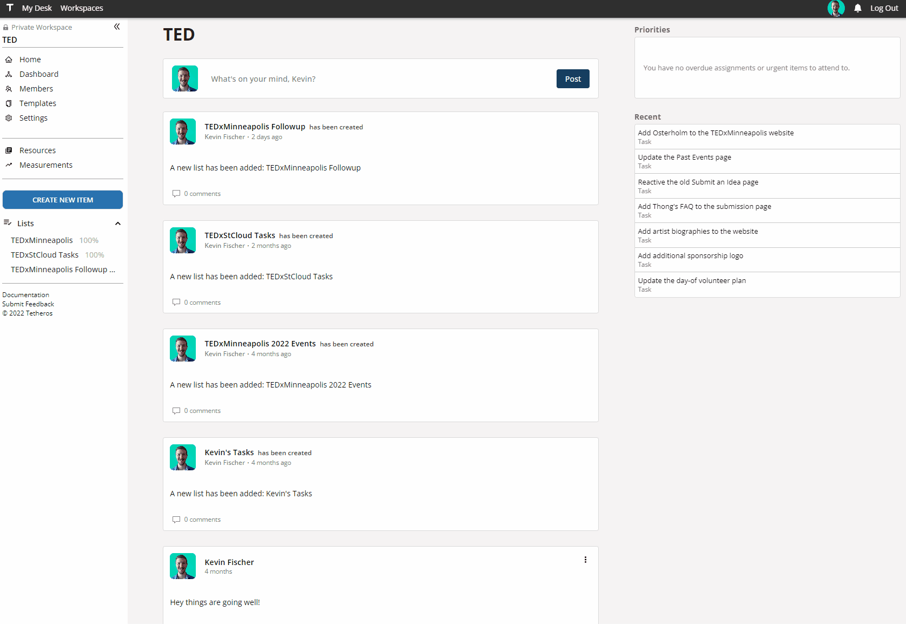
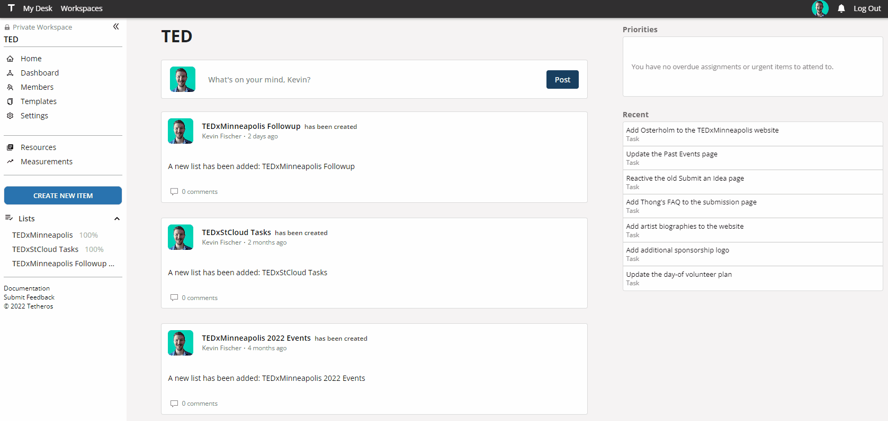
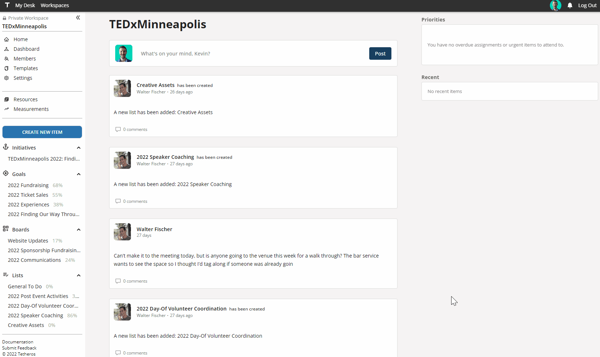

# v0.1.22 
**Released October 5, 2022**
  
---

**Released:** October 5, 2022  
**Focus:** Easier user management to make platform growth easier  
---  
We're getting ready to offer the paid version of Tetheros later this year, so we're turning our focus to the non-sexy updates of payment processing, user activity auditing, and taxes.  
  
Woo!  
  
On top of that, we're starting to hear feedback around platform use and introduced improvements to make it easier to grow your team.  This release includes:  
- **[Easier team growth](#easier-team-growth):** Add users to your workspace who aren't on Tetheros
- **[Network activity](#network-activity):** Glance at how active your teammates are (networks only)
- **[Catalog improvements](#catalog-improvements):** More options at your fingertips 
- **[Goal form appearance](#goal-form-appearance):** Update UI to appear more consistent with other areas
- **[Initiative calendars](#initiative-calendars):** See all your connected ideas in one calendar  
- **[Activity metadata capture](#activity-metadata-capture):** More data around how your team operates
  
If you'd like to know what's coming down the pipeline, check out **[the roadmap](/docs/roadmap)**.  
# Team Management  
  
### Easier team growth  
Invite others that aren't on Tetheros to join your **private workspace**:  
  
  
  
They will receive an email if they don't have an account on Tetheros.  If they have an account, they will be automatically added to your private workspace if you have enough seats available.  

### Network activity  
See who is considered an active user in your network under the **Network Users** panel.  
  
  
  
Active users are considered anyone who has authenticated to your network since the beginning of the current month.  For license purposes, this will be updated to reflect the beginning of your billing cycle instead of the beginning of the month... unless, of course, your billing cycle begins at the start of each month.
# Digital Catalog  
  
### Catalog improvements
Catalogs now include `KPI` and `Resource` items to make it easier than ever to paint the picture of your work.   
  
  
  
### Goal form appearance  
The catalog form to create a new goal was visually updated to match styles in other areas of Tetheros.  
  
  

# Clarity  

### Initiative calendars
Initiatives now display all aligned items on a single calendar.  You can filter what is shown by type. 
  
  
  
Future improvements will focus on bringing more clarity to anything aligned here, including assignments, alternative views, and analytics.
### Activity metadata capture  
Tetheros is now keeping track of who is getting more work done 😎  
  
When an item is completed:  
- **If it has an owner,** the owner will be marked as the `completor` even if someone else marked the item complete.  
- **If it has no owner,** the user that marks the item complete will receive credit for completing it.  
  
---  
Thoughts?  Comments?  Haiku?  **[Send it our way](mailto:ideas@tetheros.com)**
  