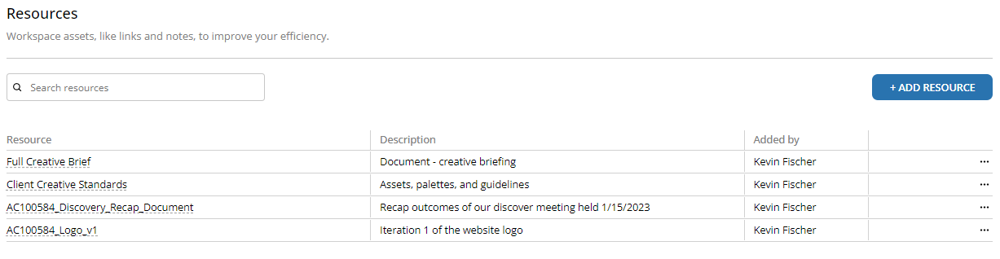

It's not only important to equip your team with resources and context, it's also important to strategically onboard them into new efforts. 

This release features tools to help you operationalize your team quicker.  It is a small and mighty release.  
  
The rundown:  
- **[Workspace Onboarding](#workspace-onboarding):** Greet your team when they enter the (virtual) door
- **[Project Resources](#project-resources):** Quick access to contextually relevant information for the project
- **[Workspace About](#workspace-about):** Fly your flag for all to see and liven up the personality of your workspace
- **[Task Optics](#task-optics):** Did we get that one thing done that we had to do yesterday?
- **[Slimmer Resources Page](#slimmer-resource-page):** No more giant rows.  Sleeker and more familiar resources layout.
  
## Workspace Onboarding  
Create a custom message (using Markdown) for new teammates to see when they visit the workspace for the first time.  

An onboarding message, which you can enable from the workspace settings, allows efficient communication to users in your workspace to quickly get them up to speed.  

  
  
Customize and activate your onboarding message from the `Settings` menu of the workspace:  
  
  
  
## Project Resources  
Store all the relevant resources directly in the project to improve context for everyone.  

  
  
Note: all resources can be located in the Resources page of the workspace, even if they aren't linked with a project.
## Workspace About  
Fly your flag for all to see and liven up the personality of your workspace with an official description!  

  
  
Change the description in workspace settings.
  
## Task Optics  
See what was recently completed, deleted, or archived from the workspace feed:  

  
  
## Slimmer Resource Page  
The resource page appearance was given a facelift to make more fit on the screen and remove the unnecessary design complexities.  

  

  
If you'd like to know what's coming down the pipeline, check out **[the roadmap](/docs/roadmap)**.  

## Squashed Bugs: 1  
We got 1 (and found a few others, but they crawled away)!  
- Resolve lag and display issues that presented when switching between workspace components too quickly 
  
Find any others?  **[Let us know](mailto:ideas@tetheros.com)**

---  
Thoughts?  Comments?  Haiku?  **[Send it our way](mailto:ideas@tetheros.com)**