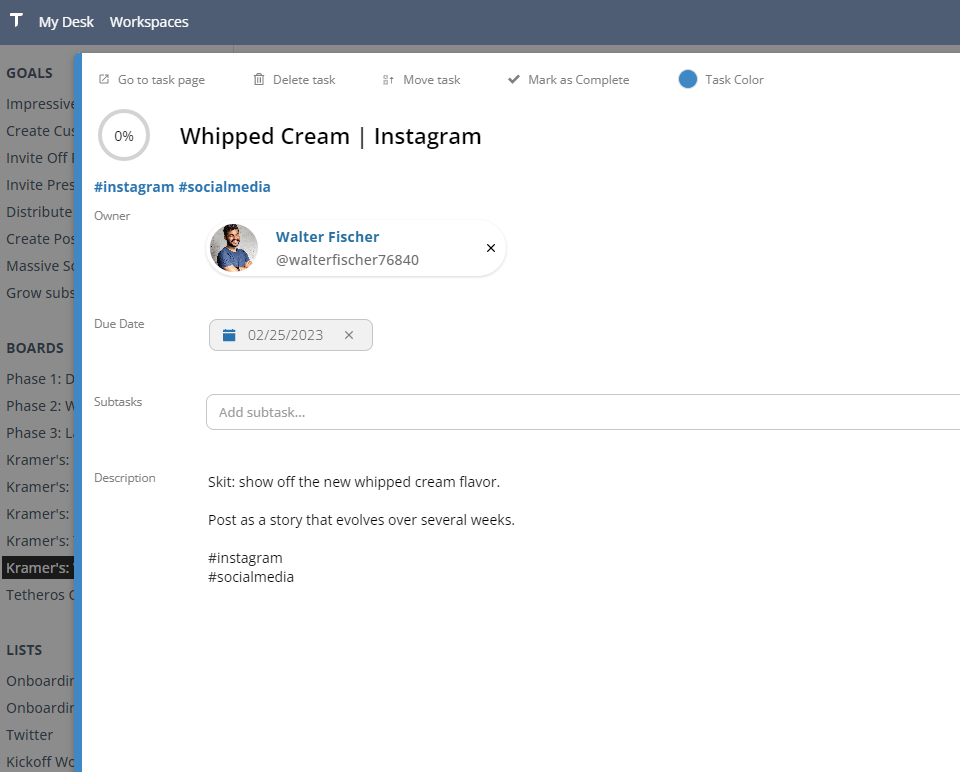
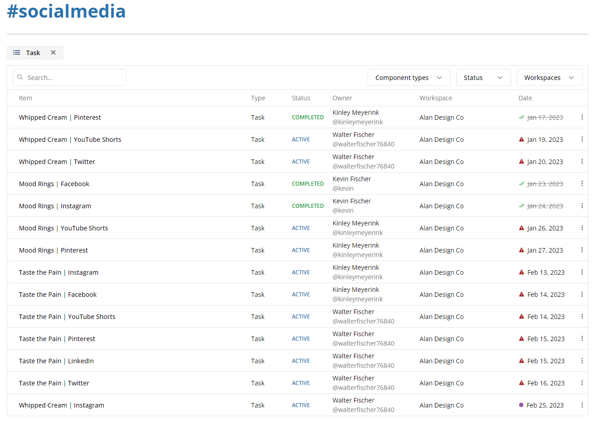

Introducing `Tags`: a tool to help you organize ideas across any workspace component.  Simply add any number of hashtags to a description and that item will be automatically grouped with others that share the tag.  

More on tags below.  The rest of this update includes:     
- **[Tags](#tags):** Easily create connections across your entire workspace
- **Board Filters:** Filter cards by owner or a search term
- **Onboarding Message:** Re-broadcast your message whenever it changes
- **User Handles:** No more numbers.  New users get `@{{ first_name }}{{ last_name }}` if its available.
- **Post Editing:** Oops!  No more deleting and re-writing posts.  Edit instead.
  
## Tags  
  
Easily create connections across your entire workspace by adding hashtags to any description.  In future updates, we'll allow you to tag posts too.  
  
  
  
For example, add `#LinkedInContent` to any tasks that represent a piece of content being prepared for LinkedIn, no matter what workstream they're part of.  This makes tracking complex workflows easier by bridging tasks with tags.  
  
  

  
**How to use tags:**  
1. Create or open a task  
2. Edit the description field  
3. Add any number of tags.  Tags need to be one word and start with a `#` for recognition.  
4. Any tags are displayed on the page.
5. Remove them by omitting them from the description.  
  
🟢 You can tag anything with a description  
🟢 In later updates, tags will play a pivotal role in building views, dashboards, sprints, and more.  
⚠️ Tags are case sensitive  
⚠️ Tags do not auto-complete (yet)  
  
## Bugs  
  
- Visual height issues with Calendars 
- Fix delete button that didn't work in the task popup modal  
- Visual bug with small screens that caused the sidebar to cover the main content  

If you'd like to know what's coming down the pipeline, check out **[the roadmap](/docs/roadmap)**.  
  
Find any others?  **[Let us know](mailto:ideas@tetheros.com)**

---  
Thoughts?  Comments?  Haiku?  **[Send it our way](mailto:ideas@tetheros.com)**