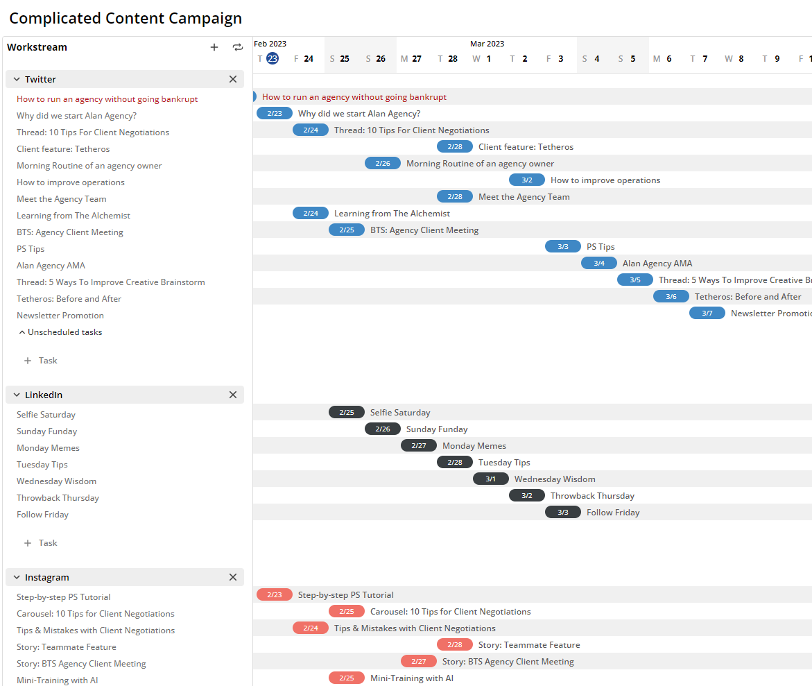

---
id: v0.2.5
sidebar_position: 9991
sidebar_class_name: hidden
---  

# v0.2.5  

**Released:** February 23, 2023  
**Focus:** Timeline  

---  

Introducing the `Timeline`: a tool that makes coordinating complicated campaigns a whole lot easier.     
  
More below.  This release includes:  
- **[Timeline](#timeline):** Coordinate complex workstreams from a visual time-based view
- **Card Colors:** Cards on a board can be assigned a color for more personality (and inner beauty)
- **Workspace Verification:** Workspaces in a network now have a badge indicating their status
- **Network Projects & Goals:** Removed network-level projects and goals (for now)
- **Assignment Table Filters:** Filters now behave more intuitively.  They got weird for a minute.
- **Performance Improvements:** Boards and tasks now purr like a high-performance collaboration platform
  
If you'd like to know what's coming down the pipeline, check out **[the roadmap](/docs/roadmap)**.  
  
## Timeline  
  
Timelines allow you to organize task schedules and delivery across any channel in visualized workstreams.  
  
  
  
Create, edit, and complete work across workstreams from a single view - regardless of how the individual workstreams are setup.  
  
- Add any workstream to a Timeline  
- See all tasks that aren't scheduled... then schedule them  
- Update, assign, and complete any tasks in a timeline  

## Bugs   
  
- Creating a post in a workspace updates user activity  
- Fixed flickering when moving cards around on a board
  
Find any others?  **[Let us know](mailto:ideas@tetheros.com)**

---  
Thoughts?  Comments?  Haiku?  **[Send it our way](mailto:ideas@tetheros.com)**