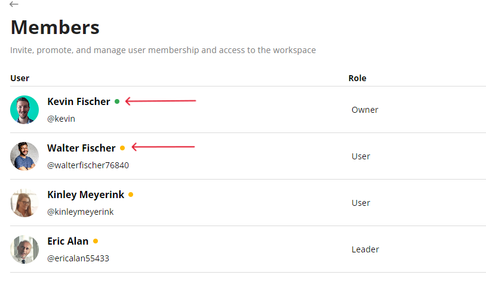
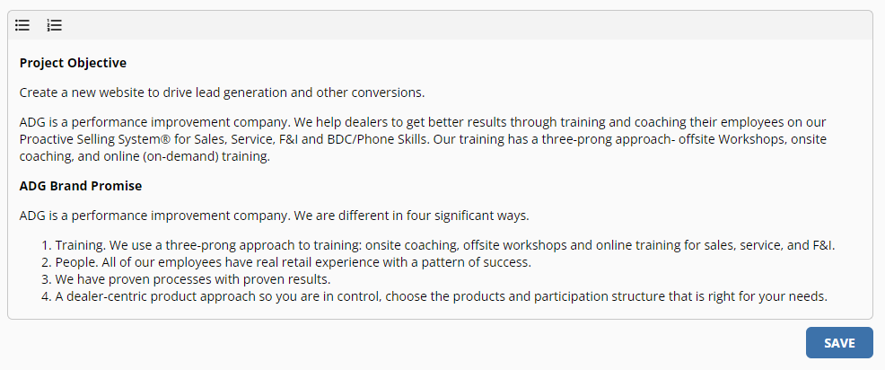
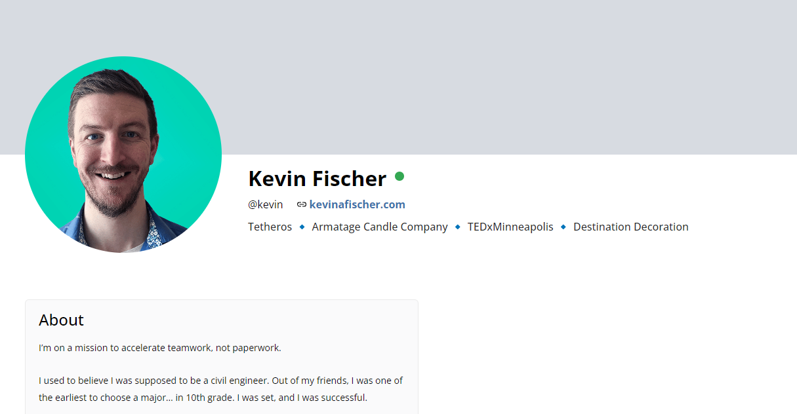
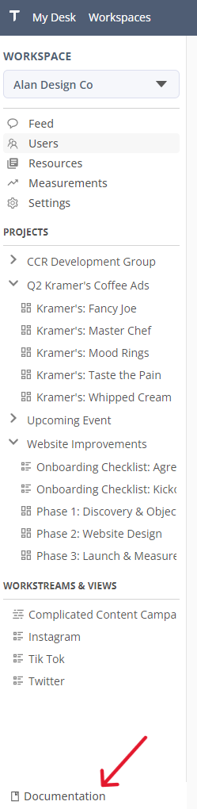

# v0.2.6.1  
  
---

**Released:** March 21, 2023  
**Focus:** Quality of life
---  

Various small utility and visual improvements across the application       
  
This release includes:  
- **[User activity indicators:](#user-activity-indicators)** User activity shown in a tiny colorful dot 
- **[Descriptions support rich text:](#rich-text-descriptions)** For all the bold, unordered list your heart desires 
- **[Profile page visual improvements:](#profile-page-improvements)** Show off your best angles, now on Tetheros
- **[Sidebar memory:](#sidebar-memory)** Stop wrestling with menus that want to stay collapsed 
- **[Documentation link:](#documentation-link)** Want to hear a nonfiction tale based on product documentation? 
- **Default profile picture colors:** Your default background color is based on the length of your name 
- **Hide dashboard and templates:** No one knew what these were for, anyway 
  
If you'd like to know what's coming down the pipeline, check out **[the roadmap](/docs/roadmap)**.  
  
## User Activity Indicators  

From the **Users** page of any workspace, see who has recently been in Tetheros, regardless of where they spent their time.  

 

    
## Rich Text Descriptions  
  
Descriptions now support rich text.  These are currently rolled out for:  
- Projects
- Tasks
- Goals  
  
 

Additional supported commands (not in toolbar) include:  
- **Bold:** CTRL + B  
- **Italic** CTRL + I  
- **Undo** CTRL + Z  
- **Redo** CTRL + Shift + Z
    
## Profile Page Improvements  
A fresh layout of your beautiful face.  

 

    
## Sidebar Memory  
Your sidebar now remembers if you left it expanded or collapsed!  
  
## Documentation Link  
A quick way to read the fascinating library of Tetheros documentation in your sidebar!  

 
  
## Bugs   
- Corrected a visual glitch where the workspace dropdown appeared below the project expansion arrow 
  
Find any others?  **[Let us know](/bugs/report)**  

---  
Product ideas?  Comments?  Haiku?  **[Send it our way](/features/request)**  