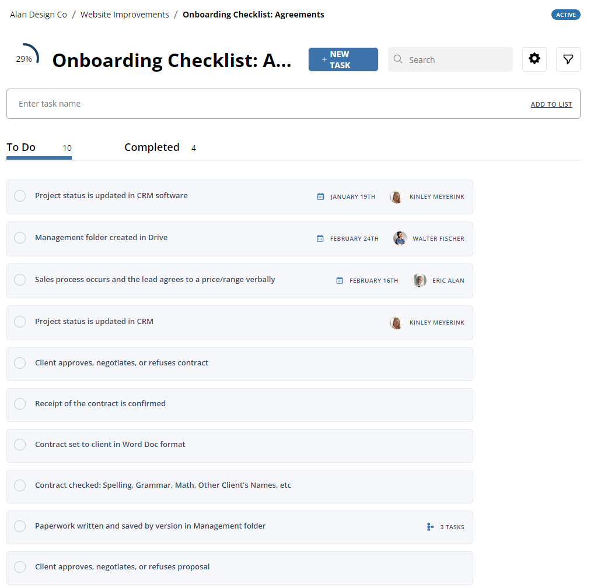
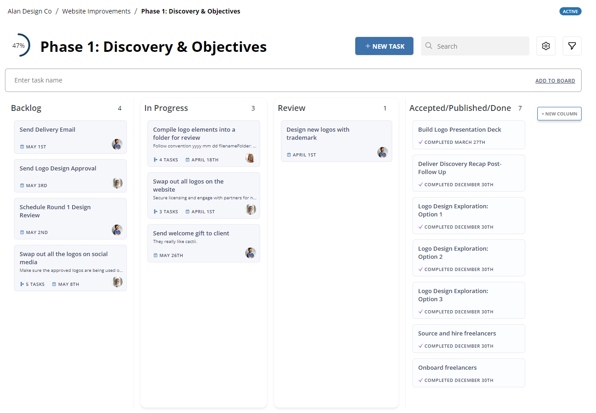
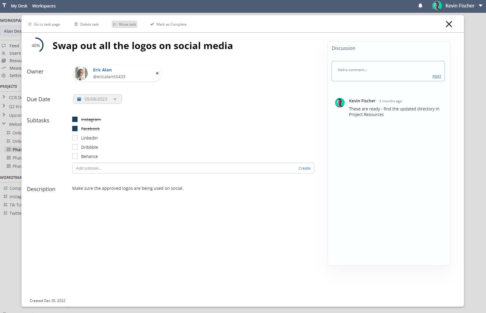

# v0.2.7  
  
---

**Released:** March 29, 2023  
**Focus:** List & Board Experience
---  

Introducing a revamped experience with lists and boards to make task management more intuitive and effective.   
  
This release includes:  
- **[Lists:](#lists)** To Do lists just got sleeker and more beautiful   
- **[Boards:](#boards)** A fresh new way to move those cards to the definition of done 
- **[Task Creation Megabar:](#task-creation-megabar)** A better way to add simple tasks to your workstreams
- **[Task Details Modal:](#task-details-visual-update)** Some things have moved around on the task details modal
- **Tooltip Improvements:** Board columns and long component names now have tooltips that appear when you hover over them
  
If you'd like to know what's coming down the pipeline, check out **[the roadmap](/docs/roadmap)**.  
  
## Lists  
Lists have a new look to make task management far simpler than before:  
  
 

Nothing has changed structurally with how lists manage tasks.  The top area of the list features a new search field and a filter area to narrow to your focus.  The options to filter the list into different subsections - like owner and date - have been replaced by these new filtering and search tools.  

## Boards  
Boards have a new look and feel:  
  

  
  
There is a new button for adding a column that lives on the right side of the board.  You can still add columns in specific places by hovering between columns and clicking the "+" button that appears near the top of the columns.  
  
The *quick task* bar at the top of each column is now gone, replaced with the Megabar that spans the top.  Alternatively, you can create multiple tasks directly in a column by using the "New Task" button and choosing a state in the dropdown that appears.

## Task Creation Megabar  

Lists and boards now feature a single megabar near the top!  

  
  
Typing a task into this and pressing enter will create a new task, but you can also paste multiple lines of items into the bar at once to generate many tasks at the same time.  This will currently limit creation to 50 items, and force them into the first column on the left.

## Task Details Visual Update  

Clicking any task opens the new task details modal: 

  
  
Nothing has changed structurally, but we've made some visual improvements and updated the discussion panel on the left to a top-to-bottom approach instead of a bottom-to-top one.  Hashtags have also been moved to the discussion area.
  

## Bugs   
- The user filter on boards no longer starts fully populated... which was confusing and unconventional (by accident... we promise)  
- Crushed a problem where typing something near a description field would force the cursor into the description field.
  
Find any others?  **[Let us know](/bugs/report)**  

---  
Product ideas?  Comments?  Haiku?  **[Send it our way](/features/request)**  