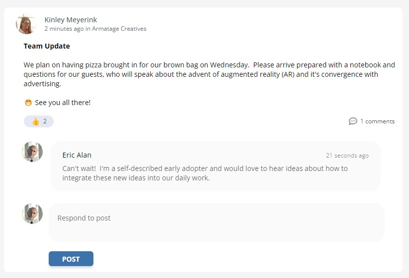
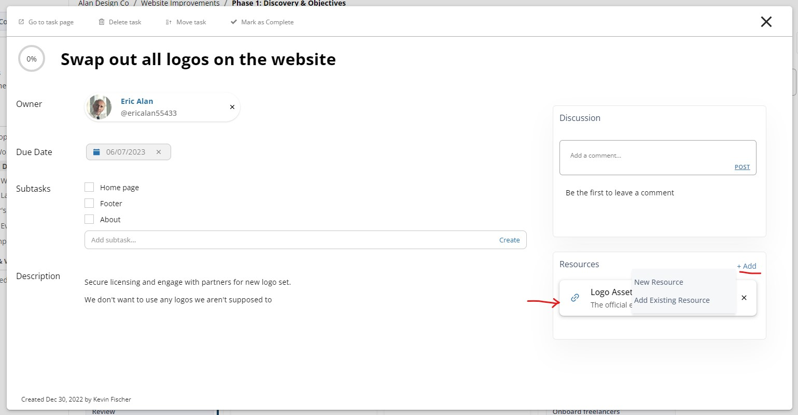

# v0.2.8  
  
---

**Released:** May 30, 2023  
**Focus:** Communications Update #1
---  

A small step towards improving the way teams communicate at work.  This release powers the ability for users to react to work and digest updates from others more efficiently.  Also included: higher calendar fidelity!   
  
This release includes:  
- **[Posts:](#posts)** Your feed is not only more beautiful, but more likeable as well 👍   
- **[Calendars:](#calendars)** Get more done from the beloved view of the calendar, now with Hi-Fi™ (not actually trademarked, sadly) 
- **[Resources:](#resources)** Link your workspace cat pictures directly to a task, or create a new link directly from any tasks (feline-optional) 🙀
  
If you'd like to know what's coming down the pipeline, check out **[the roadmap](/docs/roadmap)**.  
  
## Posts  
  
Posts have been updated to make team interactions more pleasant, useful, and engaging.  This includes:  
- Visual update to how posts are displayed in your feed  
- Introduction of the **like** reaction to posts: more to come over time  
- New *update* posts showing progress made by the team  
- Better notifications when people comment on your posts, or respond to something you've commented on  

  
  
  
## Calendars  
Calendars no longer try to fit everything in a tiny box.  Work is now shown more clearly while also allowing nearly-complete interactions with its items:  
- Completing, archiving, or reactivating tasks  
- Due date shuffles  
- Description editing  
  
It's now possible to create a new task from the calendar by clicking on a specific date.

  
  
  
## Resources  
Tetheros works hard to improve how much context is available.  Adding and creating necessary resources at the **task** level is a key part of that strategy.  

  
  
  
## Bugs   
  
The Bug Squad™ (also not actually trademarked) got to work fixing these issues:  

- Creating a new workstream failed when trying to align with an existing project  
- Adding a new task to a board placed the task in the second or third position instead of the first  
- Search bar of assignments didn't search by task name, only by description  
- When there are too many people in a team they are cut off in the modal   
  
How'd we do?  Find any others?  **[Let us know](/bugs/report)**  

---  
Product ideas?  Comments?  Haiku?  **[Send it our way](/features/request)**  