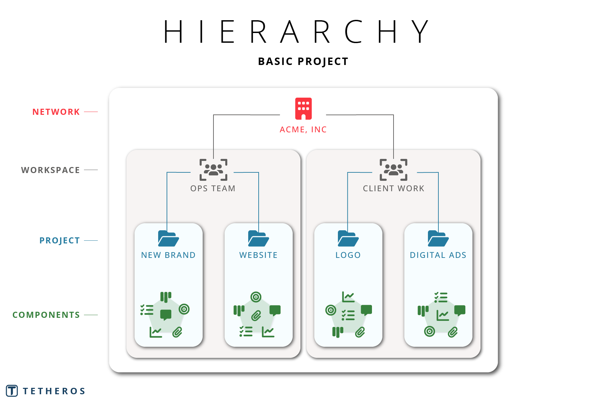
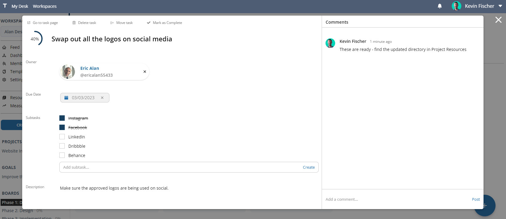
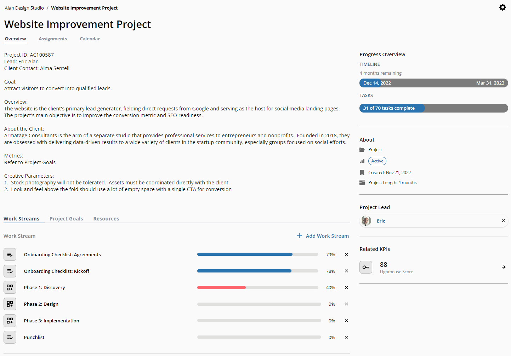
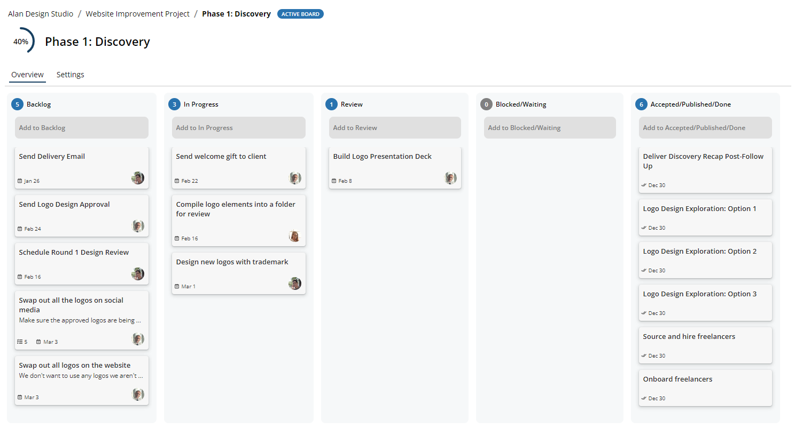
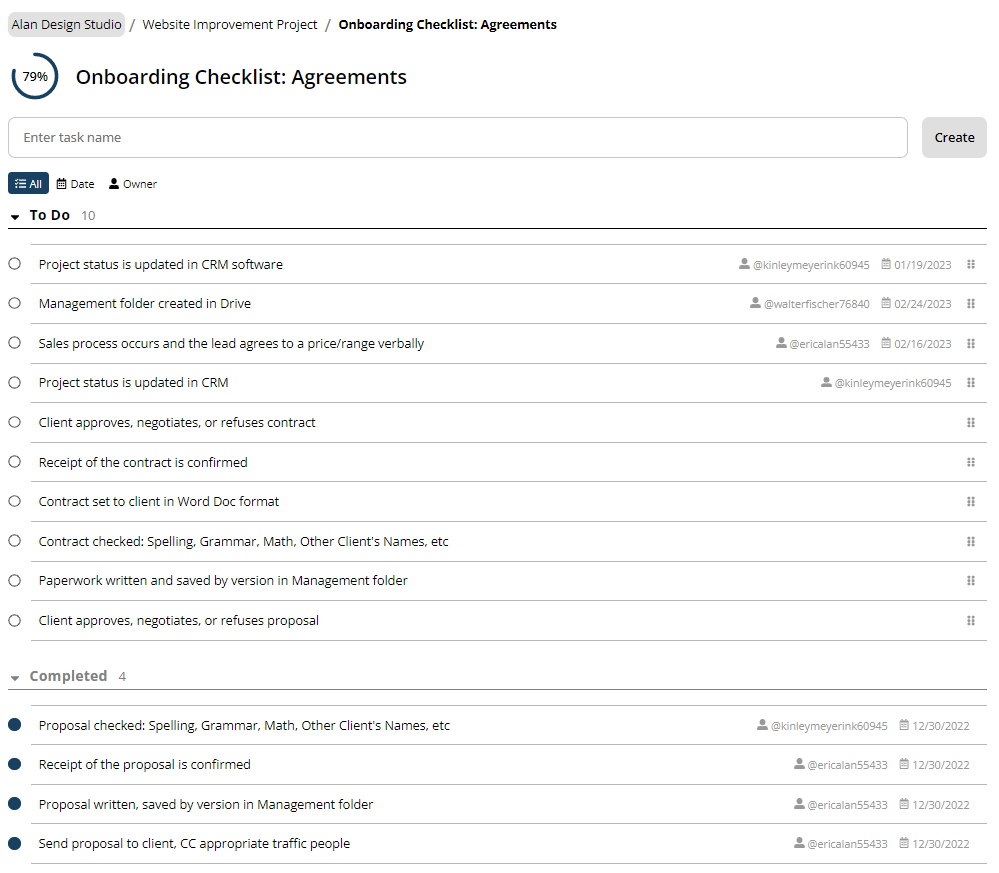
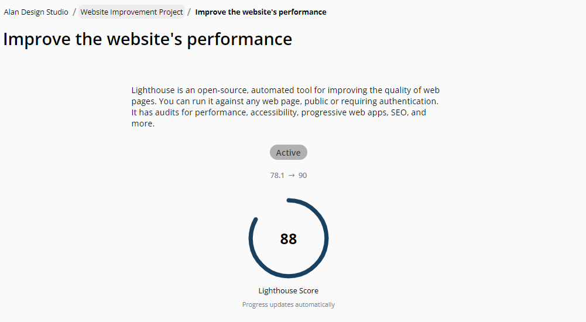
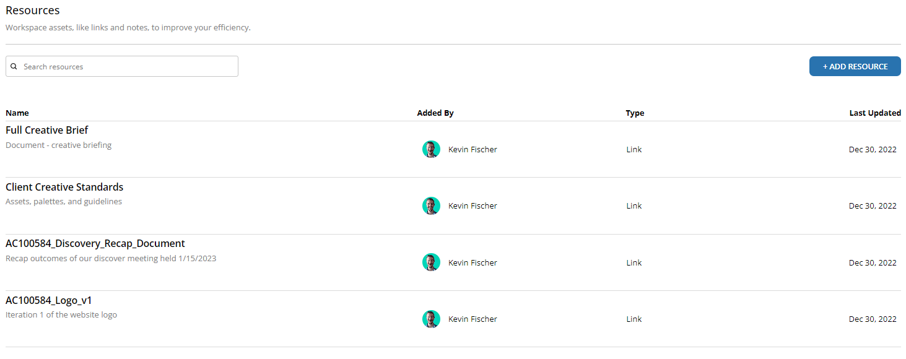

# Quickstart
Welcome to the world's most powerful professional platform for professional alignment.  Select an item below to jump to it:  
- [**Tetheros Basics:**](#tetheros-basics) How to navigate your workspace  
- [**Use Cases:**](#use-cases)  How to know if Tetheros can help you achieve your mission  
- [**Main features:**](#main-features)  Explore the platform's capabilities  
  
---  
  
**How To...**  
- [**Get Started:**](#quick-start) Watch a quick 8-minute video about basic navigation 
  
## Tetheros Basics  
Your mission is divided into several layers to give you flexibility and visibility into your work:  

  
  
---  

**Networks** represent your entire business, division, or team.  They group workspaces into a common organization, and allow creating specific roles and teams for access and permission.  Networks are also capable of hosting projects, goals, and content shared among different workspaces in the network.  *Requires a Pro license or higher*.  
  
---  
**Workspaces** are a logical group of work, often used to represent a department or a client.  Workspaces allow you to organize distinct efforts and measure their success using projects or standalone components (like boards and lists).  The primary benefit of a workspace is how it exposes your team's alignment and progress.  
  
What could a workspace represent?  
- A single client's portfolio of projects ⬅ ***recommended***
- Departments or teams in your business
- Volunteer effort 
- A recurring event
  
---  
**Projects** are efforts made by your team that have a start and finish.  Add workstreams, goals, and resources to project that help shape the purpose and progress you're making.  Tetheros offers many ways to customize projects to fit your team's preferences for work styles and communication.  
  
Use projects for:  
- Client projects  
- Event planning  
- Business initiatives  
- General operations  
  
---  
**Components** are the tools you have for getting work done.  These include tasks, ways for *organizing* tasks, goals, and many more.  Components allow you to approach the mission your way.  Tetheros allows you to create components from a catalog and connect them to other items in your workspace.  Don't have a "project" at the moment but need to track some work?  Create a board or list.  Want to independently measure how many followers your social media page has?  Create a KPI just for that.  Or lump everything together into a project if that's what you need.  
  
Common component types:  
- Checklists  
- Boards (card-style Kanban)  
- KPIs  
- Goals  
- Resources (hyperlinks, documents, etc)  
  
As Tetheros grows, the available workspace component catalog will grow too.

## Use Cases  
Employ Tetheros for a wide variety of missions, including (but not limited to):  
  
### Design & Digital Marketing Agencies  
Improve your profitablilty with Tetheros with better operational efficiency.  
  
| Requirement | Value |  
| --- | --- |  
| **Organizing client projects** | Create an individual `workspace` for every client to independently track their projects and all associated resources |  
| **Tracking client success** | Define client-specific `Key Performance Indicators` to track over time.  Connect them to active projects to report on, and view, how your efforts deliver measurable results for your clients.  |  
| **Progress reporting** | Grant limited workspace view access to clients so they can communicate with your team and see progress without giving them the keys to the Chevy.  |  
| **Business operations** | Create workspaces for your actual business to track internal projects, growth metrics, and administration tasks  |  
| **Strategic planning** | Set goals and targets for your team and business in Tetheros that provide context to every move you make  |  
| **Project delivery** | Build boilerplate templates for every stage of your projects to eliminate the busywork of "setting up" projects (which significantly improves how billable your team is)  |  
| **Content creation** | Use kanban boards, checklists, and calendars to create and visualize every stage and platform you're creating content for |  
  
---  

### TEDx Event Planning  
Spend less time organizing your team and volunteers and more time delivering outcomes toward your next salon, studio, or TEDx event.  
  
| Requirement | Value |  
| --- | --- |  
| **Volunteer onboarding** | Create custom onboarding processes for new members to get them connected and operational, automatically |  
| **Event metrics** | Track and set goals for ticket sales, video views, social media engagement, Net Promoter Scores, and anything else your chapter wants to measure  |  
| **Nonprofit operations** | Build clear processes and workflows for every team, especially attendee experience, sponsorship, and curation.  |  
| **Fundraising** | Track and record the status of different sponsors and donors with custom stages from start to finish.  Overtime, use your historical data to improve your relationships.  |  
| **Community engagement** | Build templates of tasks for the team to strategically connect with the community and audience pre- and post-event  |  
| **Task management** | Create and assign tasks around your team to track overall progress toward the big day |  
| **Content creation** | Use kanban boards, checklists, and calendars to create and visualize every stage and platform you're creating content for |  
  
If you are a TEDx organizer, please reach out directly for discounted licensing. *Tetheros is not officially sponsored by TEDx or TED.*  

## Main Features
A brief look at some of the tools in Tetheros:  
  
---  
  
### Tasks  
Tasks are the basic unit of work.  Assign, complete, and comment your way to victory!  
  
  
  

---
  
### Projects  
**Projects** offer a single place to organize work, goals, and resources for a single effort.  
  
  
  
---  
  
### Boards  
**Boards** allow your team to organize tasks in workflows, kanban-style.  
  
  
  
---
  
### Lists  
**Lists** are simple ways to track tasks without any complexity.  
  
  
  
---
  
### Goals  
**Goals** let you track progress of a key performance indicator or manually.  
  
  
  
---
  
### Resources  
**Resources** connect Tetheros to external files, folders, and websites.  
  
  
  
---
  
## Quick Start  
  
<iframe width="560" height="315" src="https://www.youtube.com/embed/u0I2R1itVx8" title="YouTube video player" frameborder="0" allow="accelerometer; autoplay; clipboard-write; encrypted-media; gyroscope; picture-in-picture" allowfullscreen></iframe>  
