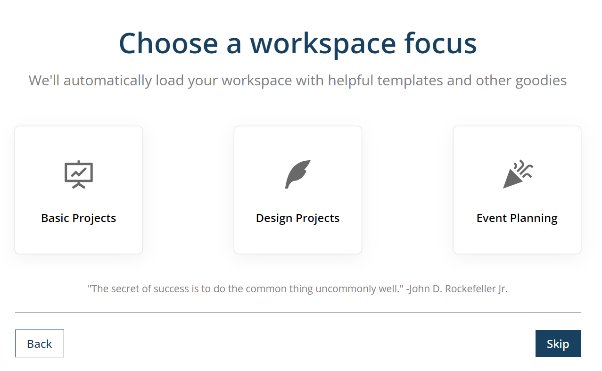
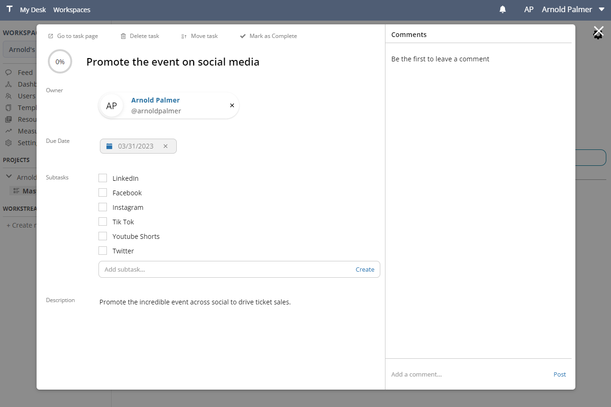

---
sidebar_position: 2
id: 'quickstart'
---  

# Quickstart  
  
<small>Updated for version <code>v0.2.6.1</code></small>  

Welcome to the world's most powerful professional platform for professional alignment.  
  
In this tutorial, we'll:  
- [Create an account](#create-an-account)  
- [Setup a project](#setup-a-project)  
- [Create tasks](#create-project-tasks)  
- [Build a goal](#build-a-project-goal)  
- [Add a resource](#add-a-workspace-resource)  
  
Let's get started!  
  
## Create an account  
  
1. Head to [**https://tetheros.com/register**](https://tetheros.com/register) to create a new account  
  

  
2. Enter a name, an email address, and a password.  
  
Tetheros will automatically log you in and present you with the **onboarding wizard**:  

   

  
## Setup a project 
  

1. Pick a name for your **workspace**.  
  

  
<strong>What is a Workspace?</strong>

  

    
Workspaces store everything you and your team are working on.  All of your projects, tasks, goals, and posts live inside a single workspace.

  

  
  

  

 
  
Typically, workspaces are named after your business or team.  Since workspaces can hold unlimited projects, you usually don't want to name the workspace after a project.  Example workspace names:  
- `Marketing Department`  
- `TEDxMinneapolis`  
- `Arnold's Freelance Work`  
  
   

:::info

You can change your workspace name at any time.

:::  

 
  

2. Choose a **workspace focus:**  
  
  

  
  
The **workspace focus** decides which items are initially created for you in your workspace.  If you skip this, your workspace will start empty.  Here are the possible options:  
  
| Workspace Focus | Project | Generated Workstreams |    
| --- | --- | --- | --- |  
| `Basic Projects` | Yes | Master Project Task List (Checklist) |   
| `Design Projects` | Yes | Project Tasks (Kanban Board) |   
| `Event Planning` | Yes | Master Event Task List (Checklist) |  
  
3. Create an initial list of **tasks** to complete (optional).  
  
Tetheros will redirect you to your new **Project** when you are done with the wizard.  
  

  
<strong>What is a Project?</strong>

  

    
Projects are a high level item in a workspace.  They represent... projects!

     
    
From the project page you can view all linked tasks, goals, and edit or view the timeline and description.

  

  
  

   

  
  
## Create project tasks  

In Tetheros, **tasks** don't live directly in a project. They live in **workstreams**.  
  

  
<strong>What is a Workstream?</strong>

  

    
Workstreams are a specific method of organizing tasks, ranging from simple Checklists to multi-column Boards.

     
    
How you decide to organize tasks is up to you. 

  

 
  

Create additional workstreams directly in a project anytime it makes sense to separate work.  A workstream was already set up for the project, so navigate to it by clicking on it in the Project or selecting it from the sidebar.  
  
  
  
  
Interact with the workstream - a list or board - to create additional tasks.  Click directly on a task after creating it to make changes to its:  
- Owner  
- Due date  
- Description  
- Status  
  

  
<strong>How do workstreams and tasks relate to projects?</strong>

  

    
Workstream progress contributes to <strong>project progress</strong>.

     
    
This means if you complete 100% of the tasks in a workstream connected to a project, the project will reflect that progress accordingly.  Projects serve many purposes - tracking shared progress across multiple workstreams is one of them.

     
    
Goals behave the same way; as goal progress increases, the project's overall progress meter increases as well.

     
    
<strong style={{color: "green"}}>In Tetheros, a project's progress is a reflection of the progress of everything aligned underneath (workstreams and goals).</strong>

  

  
  

  

  

   

  
  

## Build a project goal  
  
To create a goal for the project, you first need to add a new **KPI**.  A KPI is the raw data used to create a goal.  
  

  
<strong>What is the difference between a Goal and a KPI?</strong>

  

    
A <strong>KPI</strong> is the raw data or measurement of something.  For example, "savings account balance" or "load time".  It exists as a big dumb piece of data with no opinion on what it should or shouldn't be.  Just an honest measurement.

     
    
A <strong>Goal</strong> sets a target for a KPI to become.

     
    
For example:

     
    
If we create a KPI for <strong>Monthly Website Visitors</strong>, we could set a Goal to reach 1,000 by next month.

     
    
If we create a KPI for <strong>Fundraised Money</strong>, we could set a Goal to reach $20,000 by the end of the year.  Throughout the year, we would update the value for Fundraised Money and the changes would be reflected in the goal - or goals - set.

  

  

  
1. Select **Measurements** from the sidebar to create a new KPI:  
   

  
   

2. Create a new KPI with an initial starting value.  
- In the event planning project example, the KPI could be `Tickets Sold`, which would have a starting value of 0 until any tickets are sold.  
   

  
   

Manage all KPIs in the workspace from the **Measurements** panel.  Navigate back to the project using the breadcrumbs at the top of the workstream or by selecting it in the sidebar.  
   

3. In the **Project Goals** section of the project, select **Connect or create new project goal**:  
     

  
   

4. Create a new **metric-based goal** with the objective, *Sell out the entire MGM Grand*, with a target value of 20,000 (because the MGM Grand can hold 20,000 people).
   

  
   

As tickets are sold, update the **Tickets Sold KPI** in the measurements tab.  The goal will automatically update to reflect its progress:  
  
   

  
   
   

5. Click the **goal** in the **Project** to view, comment, or adjust it.  
   
   

  

 

  
## Add a workspace resource  
  
Create a **resource** in your workspace to help your team track and find different files, websites, and tools in the environment.  
  
1. Select **Resources** from the sidebar and click **Add Resource**  
  
  
  
2. Fill out the new resource form.  
    

  
<strong>What is a Resource?</strong>

  

    
Resources are web links with a name.

     
    
Use them to make it easy to locate important documents and websites without needing bookmarks or external libraries.  You can update the Link of the resource over time without changing the name to make it easy to find the "latest" version of something that constantly changes,

  

 
  

  
  
3. Link the **resource** with a **project**  
  
Navigate to the project and go to the **Resources** tab.  Click **Add Existing Resource** and select the recently created resource.  
  
  
  
The resource is now aligned directly with the project for quick availability to your team.  
  
:::info

You can create resources directly in a project by selecting **New Resource** in the Resource tab

:::  
  
## What's next?  
  
**Congratulations!**  There are many more things to explore in Tetheros, but you've set up a project and can get to work.  
  
Some suggested steps to take next:  
- Invite your **team** to the workspace  
- Write a  **post** to welcome everyone to the workspace  
- View the **Assignments** and **Calendar** tabs of the project  
- Create a **View** of your workstreams for simple management  
- Sign up for **Tetheros Pro**