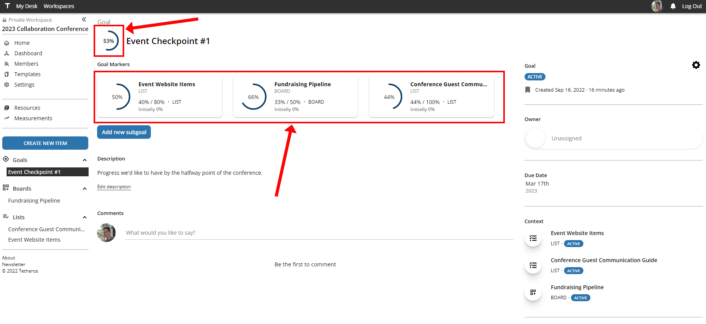

# Quickstart

Let's discover **Tetheros in less than 5 minutes**.

## 1. Create an account or log in 
  
[Click here to log in to Tetheros](https://tetheros.com/login).  
  
## 2. Create a workspace 
  
Create a workspace using the `+ New Workspace` button on the left sidebar:  
  
  
  
This will create a `Private Workspace`.  You are allowed to have 4 private workspaces with up to 40 members each.  
  
  
  
Every new workspace comes with a `🐤 Getting Started` List to help mobilize your new space.
  
## 3. Track your first tasks
  
Select a `List` or `Board` from the catalog by clicking on `Create New Item` button located on the sidebar:
  
  
  
Multiple options allow you to organize work the way that works best for you or your team.  A list or a board can represent work that is:  
- Operational in nature, meaning it is always ongoing and never "complete": `Website Bug Fixes`  
- Temporary, such as a small project: `April Marketing Asset Designs`  
- Massive, like a long-term set of requirements that eventually completes: `Event Sponsorship Pipeline`  
  
Optionally (and ideally), a `List` or `Board` is aligned in Tetheros with a `Goal` or `Initiative` to show how that work contributes to the big picture.  
  
  
  
Name your `Board` or `List` - this can easily be changed later if you regret your name choice.  
  
Boards and lists display work differently, but the core of both are `Tasks` - the actual work that needs to get done.  To create a task:  
- Click `New Task` (Boards) or `Add Task` (Lists) to open the detailed creation panel  
- Type into the `Enter task name` bar above the list (Lists)  
- Type into the desired column on the board (Board)  
  
**Boards have a designated column for items that are complete.  It is always on the far right side.  Items dragged here will be marked as `Complete` by Tetheros**  
  
  
  
  
**Lists are have tasks that are either done, or not done.  Items checked off as complete will be shown in the `Completed` area at the bottom**  
  
  
  
After adding tasks to your List or Board, click on a `Task` to change its information:  
  
  
  
In the popup, you can view or change:  
- Who the task is assigned to (owner)   
- When the task needs to be done by (due date)  
- Information about the task (description)  
- Specific requirements for getting the work done (subtasks)  
  
You can also add comments directly to the task to discuss work.  
  
  
  
## 4. Measure your shared progress 
In Tetheros, use `Goals` to track progress of a List, Board, or KPI.  We believe it's important that teams not only organize work their way, but they can **measure meaningful progress**.  
  
`Goals` enable teams to establish shared progress markers for any type of work.  
  
Start by creating a new `Goal` from the catalog:
  
  
  
After naming, describing, and scheduling your goal, **add new subgoals** for any boards, lists, or KPIs you want to track progress for:  
  
  
  
After naming, describing, and scheduling your goal, **add new subgoals** for any boards, lists, or KPIs you want to track progress for.  `Subgoals` set a target for progress towards completion and are updated automatically:  
    
  
  
You can create multiple subgoals for a single goal to make it easy to collaborate on shared progress, even with multiple different Lists, Boards, or KPIs:  
    
 
  
## 5. Give your work meaning  
  
It doesn't matter if you get a lot of work done if that work doesn't contribute to the mission.  Link your goals to an `Initiative` to **align your progress with your purpose**:  
    
  
  
`Initiatives` are a large-scale effort or strategy to help fulfill your team's mission and vision.  Depending on how you're using the workspace, an initiative could represent:  
- A single project  
- An event  
- A shared company objective, like *Improve Customer Experience*  
- An Objective in the OKR framework  
  
Initiatives track goals from the workspace, as well as any related KPIs that are useful to see at a glance:  
    

## 6. Find documents, websites, or other resources  
  
Where was the budget spreadsheet?  What is the URL for our test website?  Use `Resources` to dynamically track important locations without needing to remember every detail.  
  
Resources are accessible from the sidebar of the workspace:  
    
  
  
Create resources to quickly find where your team is storing documents and other important digital assets without needing excessive bookmarks or tedious storage strategies:  
      

  
Resources provide a friendly interface for all digital destinations.  
      

## 7. Achieve your mission  

There is a LOT more to discover in Tetheros.  [Click here to get started!](https://tetheros.com/register)